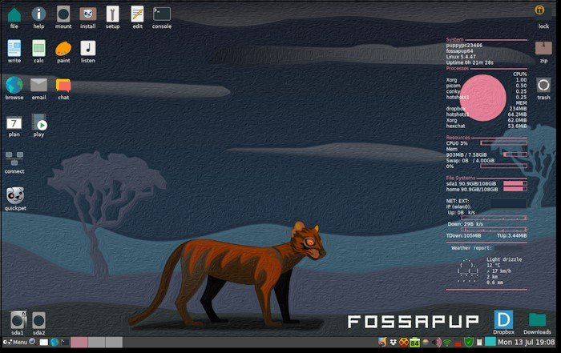

## About Puppy Linux

Puppy Linux is a unique family of Linux distributions meant for the home-user computers. It was originally created by 
[Barry Kauler](http://bkhome.org/news) in 2003.

### Puppy Linux advantage

 1. Ready to use → all tools for common daily computing usage already included.
 2. Ease of use → grandpa-friendly certified ™
 3. Relatively small size → 300 MB or less.
 4. Fast and versatile.
 5. Customisable within minutes → remasters.
 6. Different flavours → optimised to support older computers, newer computers.
 7. Variety → hundreds of derivatives ("puplets"), one of which will surely meet your needs.

If one of these things interest you, read on.

### Yes, but what does it [look and feel like](screenshots.html "Screenshot Page")?

[{: .cr-image }](screenshots.html "Screenshot Page")

### First thing first

Puppy Linux is _not_ a single Linux distribution like Debian.
Puppy Linux is also _not_ a Linux distribution with multiple flavours,
like Ubuntu (with its variants of Ubuntu, Kubuntu, Xubuntu, etc)
though it also comes in flavours.

Puppy Linux is **a collection of multiple Linux distributions**, built on
the _same shared principles_, built _using the same set of tools_, built on top 
of a _unique set of puppy specific applications and configurations_ and
generally speaking provide _consistent behaviours and features_, no 
matter which flavours you choose.

There are generally three broad categories of Puppy Linux distributions:

 * _official_ Puppy Linux distributions → maintained by Puppy Linux team,
   usually targeted for general purpose, and generally built using
   Puppy Linux system builder (called [_Woof-CE_][woof-ce]).

 * _woof-built_ Puppy Linux distributions → developed to suit specific needs 
   and appearances, also targeted for general purpose, and built using
   Puppy Linux system builder (called [_Woof-CE_][woof-ce]) with some additional
   or modified packages.

 * _unofficial_ derivatives (_"puplets"_) → are usually remasters 
   (or remasters of remasters), made and maintained by Puppy Linux enthusiasts,
   usually targeted for specific purposes.

<!--do not edit this line-->

### Why not try it? Download now! (Official distributions)

Get the ISO, burn it to a CD/DVD using your favorite CD/DVD burner, 
or _flash_ it using _dd_ ([Windows version](http://www.chrysocome.net/dd))
to your USB flash drive, or visit our [download](download.html) page
for more comprehensive information.

|Compatibility \*  | Architecture  | Latest Version        | Download link                                           |
|------------------|---------------|-----------------------|---------------------------------------------------------|
|Ubuntu Focal  64  | x86_64 64-bit | FossaPup64 9.5        | [Main][fo64] - [Mirror][fo64m] - [Checksum][fo64c] |
|Raspbian Buster   | armhf 32-bit  | Raspup 8.2.1          | [Main][rasp] - [Mirror][raspm] - [Checksum][raspc] |
|Ubuntu Bionic     | x86 32-bit    | BionicPup32 8.0       | [Main][bi32] - [Mirror][bi32m] - [Checksum][bi32c] |
|Ubuntu Bionic 64  | x86_64 64-bit | BionicPup64 8.0       | [Main][bi64] - [Mirror][bi64m] - [Checksum][bi64c] |
|Ubuntu Xenial     | x86 32-bit    | XenialPup 7.5         | [Main][xe32] - [Mirror][xe32m] - [Checksum][xe32c] |
|Ubuntu Xenial 64  | x86_64 64-bit | XenialPup64 7.5       | [Main][xe64] - [Mirror][xe64m] - [Checksum][xe64c] |
|Slackware 14.2    | x86 32-bit    | Slacko Puppy   7.0    | [Main][s732] - [Mirror][s732m] - [Checksum][s732c] |
|Slackware64 14.2  | x86_64 64-bit | Slacko64 Puppy 7.0    | [Main][s764] - [Mirror][s764m] - [Checksum][s764c] |
|Slackware 14.1    | x86 32-bit    | Slacko Puppy   6.3.2  | [Main][sl32] - [Mirror][sl32m] - [Checksum][sl32c] |
|Slackware64 14.1  | x86_64 64-bit | Slacko64 Puppy 6.3.2  | [Main][sl64] - [Mirror][sl64m] - [Checksum][sl64c] |
|Ubuntu Trusty     | x86 32-bit    | Tahrpup 6.0.5         | [Main][ta32] - [Mirror][ta32m] - [Checksum][ta32c] |
|Ubuntu Trusty 64  | x86_64 64-bit | Tahrpup64 6.0.5       | [Main][ta64] - [Mirror][ta64m] - [Checksum][ta64c] |
{: .table .table-striped .table-bordered }

[s732]: https://distro.ibiblio.org/puppylinux/puppy-slacko-7.0/32/slacko-7.0.iso
[s732m]: https://mirror.aarnet.edu.au/pub/puppylinux/puppy-slacko-7.0/32/slacko-7.0.iso
[s732c]: https://distro.ibiblio.org/puppylinux/puppy-slacko-7.0/32/slacko-7.0.iso.md5.txt
[s764]: https://distro.ibiblio.org/puppylinux/puppy-slacko-7.0/64/slacko64-7.0.iso
[s764m]: https://mirror.aarnet.edu.au/pub/puppylinux/puppy-slacko-7.0/64/slacko64-7.0.iso
[s764c]: https://distro.ibiblio.org/puppylinux/puppy-slacko-7.0/64/slacko64-7.0.iso.md5.txt
[sl32]: https://distro.ibiblio.org/puppylinux/puppy-slacko-6.3.2/32/slacko-6.3.2-uefi.iso
[sl32m]: https://ftp.nluug.nl/ftp/pub/os/Linux/distr/puppylinux/puppy-slacko-6.3.2/32/slacko-6.3.2-uefi.iso
[sl32c]: https://distro.ibiblio.org/puppylinux/puppy-slacko-6.3.2/32/slacko-6.3.2-uefi.iso.md5.txt
[sl64]: https://distro.ibiblio.org/puppylinux/puppy-slacko-6.3.2/64/slacko64-6.3.2-uefi.iso
[sl64m]: https://ftp.nluug.nl/ftp/pub/os/Linux/distr/puppylinux/puppy-slacko-6.3.2/64/slacko64-6.3.2-uefi.iso
[sl64c]: https://distro.ibiblio.org/puppylinux/puppy-slacko-6.3.2/64/slacko64-6.3.2-uefi.iso.md5.txt
[ta32]: https://distro.ibiblio.org/puppylinux/puppy-tahr/iso/tahrpup%20-6.0-CE/tahr-6.0.5_PAE.iso
[ta32m]: https://ftp.nluug.nl/ftp/pub/os/Linux/distr/puppylinux/puppy-tahr/iso/tahrpup%20-6.0-CE/tahr-6.0.5_PAE.iso
[ta32c]: https://distro.ibiblio.org/puppylinux/puppy-tahr/iso/tahrpup%20-6.0-CE/tahr-6.0.5_PAE.iso.md5.txt
[ta64]: https://distro.ibiblio.org/puppylinux/puppy-tahr/iso/tahrpup64-6.0.5/tahr64-6.0.5.iso
[ta64m]: https://ftp.nluug.nl/ftp/pub/os/Linux/distr/puppylinux/puppy-tahr/iso/tahrpup64-6.0.5/tahr64-6.0.5.iso
[ta64c]: https://distro.ibiblio.org/puppylinux/puppy-tahr/iso/tahrpup64-6.0.5/tahr64-6.0.5.iso.md5.txt
[xe32]: https://distro.ibiblio.org/puppylinux/puppy-xenial/32/xenialpup-7.5-uefi.iso
[xe32m]: https://ftp.nluug.nl/ftp/pub/os/Linux/distr/puppylinux/puppy-xenial/32/xenialpup-7.5-uefi.iso
[xe32c]: https://distro.ibiblio.org/puppylinux/puppy-xenial/32/xenialpup-7.5-uefi.iso.md5&sha256.txt
[xe64]: https://distro.ibiblio.org/puppylinux/puppy-xenial/64/xenialpup64-7.5-uefi.iso
[xe64m]: https://ftp.nluug.nl/ftp/pub/os/Linux/distr/puppylinux/puppy-xenial/64/xenialpup64-7.5-uefi.iso
[xe64c]: https://distro.ibiblio.org/puppylinux/puppy-xenial/64/xenialpup64-7.5-uefi.iso.md5&sha256.txt
[bi64]: https://distro.ibiblio.org/puppylinux/puppy-bionic/bionicpup64/bionicpup64-8.0-uefi.iso
[bi64m]: https://ftp.nluug.nl/ftp/pub/os/Linux/distr/puppylinux/puppy-bionic/bionicpup64/bionicpup64-8.0-uefi.iso
[bi64c]: https://distro.ibiblio.org/puppylinux/puppy-bionic/bionicpup64/bionicpup64-8.0-uefi.iso.md5.txt
[bi32]: https://distro.ibiblio.org/puppylinux/puppy-bionic/bionicpup32/bionicpup32-8.0-uefi.iso
[bi32m]: https://ftp.nluug.nl/ftp/pub/os/Linux/distr/puppylinux/puppy-bionic/bionicpup32/bionicpup32-8.0-uefi.iso
[bi32c]: https://distro.ibiblio.org/puppylinux/puppy-bionic/bionicpup32/bionicpup32-8.0-uefi.iso.md5.txt
[rasp]: httpss://distro.ibiblio.org/puppylinux/arm/puppy-raspup-8.2.1/raspup-8.2.1-a60dc46d9-2gb-f2fs-swap.img.zip
[raspm]: https://ftp.nluug.nl/ftp/pub/os/Linux/distr/puppylinux/arm/puppy-raspup-8.2.1/raspup-8.2.1-a60dc46d9-2gb-f2fs-swap.img.zip
[raspc]: https://distro.ibiblio.org/puppylinux/arm/puppy-raspup-8.2.1/raspup-8.2.1-a60dc46d9-2gb-f2fs-swap.img.zip.md5.txt
[fo64]: https://distro.ibiblio.org/puppylinux/puppy-fossa/fossapup64-9.5.iso
[fo64m]: https://ftp.nluug.nl/ftp/pub/os/Linux/distr/puppylinux/puppy-fossa/fossapup64-9.5.iso
[fo64c]: https://distro.ibiblio.org/puppylinux/puppy-fossa/fossapup64-9.5.iso.md5.txt

> \* Compatibility: A Puppylinux distribution can also be built and assembled using packages
> and components from another Linux distribution called in Puppy the _"binary compatible"_
> distribution. The choice of a binary compatible distribution determines the availability of 
> additional packages, among other things.

### Questions?

It has been said that the best experience of Puppy Linux is not from 
the software itself, but from the community that gathers around it.
Whatever you have in mind - praises, curses, questions, suggestions,
or just plain chit-chat, we welcome you to join us at 
[Puppy Linux Discussion Forum](https://forum.puppylinux.com) or just check 
the [discussions][download] for the latest puppylinux woof builds.

### I need more info before deciding to try ...

 1. [Frequently Asked Questions (FAQ)][faq]
 1. [Puppy Linux history][history]
 2. [Puppy Linux family tree][family-tree]
 3. [Puppy Linux Team][team]
 4. [Puppy Linux Build System (_Woof-CE_)][woof-ce]
 5. [Screenshots!][screen]
 6. [Newsletters] [newsletter]

[faq]: faq.html
[woof-ce]: woof-ce.html
[history]: history.html
[team]: team.html
[family-tree]: family-tree.html
[screen]: screenshots.html
[download]: download.html
[newsletter]: http://smokey01.com/newsletters/

 <a href="https://distrowatch.com/table.php?distribution=puppy">DistroWatch Rankings</a>

