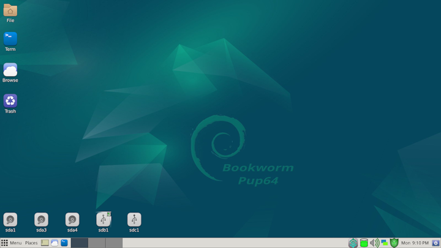
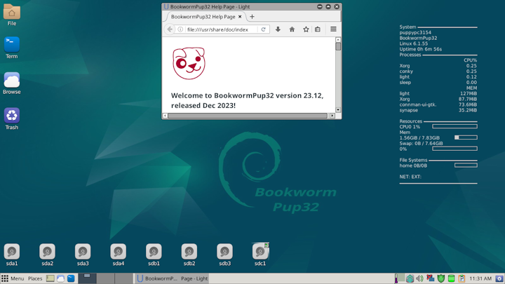

## About Puppy Linux

Puppy Linux is a unique family of Linux distributions meant for the home-user computers. It was originally created by 
[Barry Kauler](http://bkhome.org/news) in 2003.

### Puppy Linux advantage

 1. Ready to use → all tools for common daily computing usage already included.
 2. Ease of use → lots of included help & hints
 3. Relatively small size → typically 500 MB or less.
 4. Fast and versatile.
 5. Customisable within minutes → can be made permanent with remasters.
 6. Different flavours → optimised to support older & newer computers.
 7. Variety → hundreds of derivatives ("puplets"), one of which will surely meet your needs.

If one of these things interest you, read on.

### Yes, but what does it [look and feel like](screenshots.html "Screenshot Page")?

Recent releases - each Pup has its own look and feel.....

[{: .cr-image }](screenshots.html "Screenshot Page")

[Release Announcement](https://distro.ibiblio.org/puppylinux/puppy-bookwormpup/Puppy%20Linux%20Release%20Announcement.html)

[Forum Announcement](https://forum.puppylinux.com/viewtopic.php?t=8690)

[{: .cr-image }](screenshots.html "Screenshot Page")

[Release Announcement](https://distro.ibiblio.org/puppylinux/puppy-bookwormpup/Puppy%20Linux%20Release%20Announcement.html)

[Forum Announcement](https://forum.puppylinux.com/viewtopic.php?t=10087)

### First thing first

Puppy Linux is _not_ a single Linux distribution like Debian.
Puppy Linux is also _not_ a Linux distribution with multiple flavours,
like Ubuntu (with its variants of Ubuntu, Kubuntu, Xubuntu, etc)
though it also comes in flavours.

Puppy Linux is **a collection of multiple Linux distributions**, built on
the _same shared principles_, built _using the same set of tools_, built on top 
of a _unique set of puppy specific applications and configurations_ and
generally speaking provide _consistent behaviours and features_, no 
matter which flavours you choose.

There are generally three broad categories of Puppy Linux distributions:

 * _official_ Puppy Linux distributions → maintained by Puppy Linux team,
   usually targeted for general purpose, and generally built using
   Puppy Linux system builder (called [_Woof-CE_][woof-ce]).

 * _woof-built_ Puppy Linux distributions → developed to suit specific needs 
   and appearances, also targeted for general purpose, and built using
   Puppy Linux system builder (called [_Woof-CE_][woof-ce]) with some additional
   or modified packages.

 * _unofficial_ derivatives (_"puplets"_) → are usually remasters 
   (or remasters of remasters), made and maintained by Puppy Linux enthusiasts,
   usually targeted for specific purposes.

<!--do not edit this line-->

### Why not try it? Download now!

Get the ISO, burn it to a CD/DVD using your favorite CD/DVD burner, 
or _flash_ it using _dd_ ([Windows version](http://www.chrysocome.net/dd))
to your USB flash drive, or visit our [download](https://forum.puppylinux.com/puppy-linux-collection) page
for more comprehensive information. Official Pup build recipes are kept at [Woof-CE on GITHUB](https://github.com/puppylinux-woof-CE/woof-CE/tree/testing/woof-distro).

|Latest Version        | Architecture  | Compatibility \*  | Download link                                           |
|----------------------|---------------|-------------------|---------------------------------------------------------|
|BookwormPup64 10.0    | x86_64 64-bit | Debian Bookworm 64| [Main][bw64] - [Mirror][bw64m] |
|BookwormPup32 23.12   | x86 32-bit    | Debian Bookworm 32| [Main][bw32] - [Mirror][bw32m] |
|F96-CE_4              | x86_64 64-bit | Ubuntu Focal 64   | [Main][f96ce] - [Mirror][f96cem] |
|S15Pup64 22.12        | x86_64 64-bit | Slackware64 15.0  | [Main][sp64] - [Mirror][sp64] |
|S15Pup32 22.12        | x86 32-bit    | Slackware 15.0    | [Main][sp32] - [Mirror][sp32] |
{: .table .table-striped .table-bordered }

[s732]: https://distro.ibiblio.org/puppylinux/puppy-slacko-7.0/32/slacko-7.0.iso
[s732m]: https://mirror.aarnet.edu.au/pub/puppylinux/puppy-slacko-7.0/32/slacko-7.0.iso
[s732c]: https://distro.ibiblio.org/puppylinux/puppy-slacko-7.0/32/slacko-7.0.iso.md5.txt
[s764]: https://distro.ibiblio.org/puppylinux/puppy-slacko-7.0/64/slacko64-7.0.iso
[s764m]: https://mirror.aarnet.edu.au/pub/puppylinux/puppy-slacko-7.0/64/slacko64-7.0.iso
[s764c]: https://distro.ibiblio.org/puppylinux/puppy-slacko-7.0/64/slacko64-7.0.iso.md5.txt
[sp32]: http://distro.ibiblio.org/puppylinux/puppy-s15pup/s15pup32-22.12.htm
[sp32c]: https://sourceforge.net/projects/pb-gh-releases/files/S15Pup32_release/
[sp64]: http://distro.ibiblio.org/puppylinux/puppy-s15pup/s15pup64-22.12.htm
[sp64c]: https://sourceforge.net/projects/pb-gh-releases/files/S15Pup64_release/
[xe32]: https://distro.ibiblio.org/puppylinux/puppy-xenial/32/xenialpup-7.5-uefi.iso
[xe32m]: https://ftp.nluug.nl/ftp/pub/os/Linux/distr/puppylinux/puppy-xenial/32/xenialpup-7.5-uefi.iso
[xe32c]: https://distro.ibiblio.org/puppylinux/puppy-xenial/32/xenialpup-7.5-uefi.iso.md5&sha256.txt
[xe64]: https://distro.ibiblio.org/puppylinux/puppy-xenial/64/xenialpup64-7.5-uefi.iso
[xe64m]: https://ftp.nluug.nl/ftp/pub/os/Linux/distr/puppylinux/puppy-xenial/64/xenialpup64-7.5-uefi.iso
[xe64c]: https://distro.ibiblio.org/puppylinux/puppy-xenial/64/xenialpup64-7.5-uefi.iso.md5&sha256.txt
[bi64]: https://distro.ibiblio.org/puppylinux/puppy-bionic/bionicpup64/bionicpup64-8.0-uefi.iso
[bi64m]: https://ftp.nluug.nl/ftp/pub/os/Linux/distr/puppylinux/puppy-bionic/bionicpup64/bionicpup64-8.0-uefi.iso
[bi64c]: https://distro.ibiblio.org/puppylinux/puppy-bionic/bionicpup64/bionicpup64-8.0-uefi.iso.md5.txt
[bi32]: http://distro.ibiblio.org/puppylinux/puppy-bionic/bionicpup32/
[bi32m]: http://ftp.nluug.nl/ftp/pub/os/Linux/distr/puppylinux/puppy-bionic/bionicpup32/
[bi32c]: http://distro.ibiblio.org/puppylinux/puppy-bionic/bionicpup32/
[rasp]: https://distro.ibiblio.org/puppylinux/arm/puppy-raspup-8.2.1/raspup-8.2.1-a60dc46d9-2gb-f2fs-swap.img.zip
[raspm]: https://ftp.nluug.nl/ftp/pub/os/Linux/distr/puppylinux/arm/puppy-raspup-8.2.1/raspup-8.2.1-a60dc46d9-2gb-f2fs-swap.img.zip
[raspc]: https://distro.ibiblio.org/puppylinux/arm/puppy-raspup-8.2.1/raspup-8.2.1-a60dc46d9-2gb-f2fs-swap.img.zip.md5.txt
[fo64]: https://distro.ibiblio.org/puppylinux/puppy-fossa/fossapup64-9.5.iso
[fo64m]: https://ftp.nluug.nl/ftp/pub/os/Linux/distr/puppylinux/puppy-fossa/fossapup64-9.5.iso
[fo64c]: https://distro.ibiblio.org/puppylinux/puppy-fossa/fossapup64-9.5.iso.md5.txt
[bw64]: https://distro.ibiblio.org/puppylinux/puppy-bookwormpup/BookwormPup64/BookwormPup64.htm
[bw64m]: http://ftp.nluug.nl/ftp/pub/os/Linux/distr/puppylinux/puppy-bookwormpup/BookwormPup64/BookwormPup64.htm
[bw32]: https://distro.ibiblio.org/puppylinux/puppy-bookwormpup/BookwormPup32/BookwormPup32.htm
[bw32m]: http://ftp.nluug.nl/ftp/pub/os/Linux/distr/puppylinux/puppy-bookwormpup/BookwormPup32/BookwormPup32.htm
[f96ce]: https://rockedge.org/kernels/data/ISO/F96-CE/F96-CE_4.iso
[f96cem]: https://f96.puppylinux.com

> \* Compatibility: A Puppylinux distribution can also be built and assembled using packages
> and components from another Linux distribution called in Puppy the _"binary compatible"_
> distribution. The choice of a binary compatible distribution determines the availability of 
> additional packages, among other things.

### Download Sites

All the "official" Puppies since version 2 are hosted at [Ibiblio](http://distro.ibiblio.org/puppylinux/).

Ibiblio also hosts the puppy specific packages (pet) used to build puppies as 
well as squashfs files (sfs) with kernels, kernel sources, large applications 
and application frameworks.

The Ibiblio puppylinux directory is mirrored by several sites world-wide.

The [NLUUG](https://ftp.nluug.nl/ftp/pub/os/Linux/distr/puppylinux/) and the 
[UoC](http://ftp.cc.uoc.gr/mirrors/linux/puppylinux/) mirrors in Europe and 
the [AARNET](http://mirror.aarnet.edu.au/pub/puppylinux/) and the 
[Internode](http://mirror.internode.on.net/pub/puppylinux/) mirrors in 
Australia are known to update regularly and are usually faster than Ibiblio.

_Mirrors may take up to a day to incorporate changes in Ibiblio_.

### Questions?

It has been said that the best experience of Puppy Linux is not from 
the software itself, but from the community that gathers around it.
Whatever you have in mind - praises, curses, questions, suggestions,
or just plain chit-chat, we welcome you to join us at 
[Puppy Linux Discussion Forum](https://forum.puppylinux.com) or just check 
the [discussions][download] for the latest puppylinux woof builds. There is also
an [Alternative Forum](https://puppylinux.freeforums.net) which will be used only
"in emergency" to explain what is happening.

### I need more info before deciding to try ...

 1. [Frequently Asked Questions (FAQ)][faq]
 1. [Puppy Linux history][history]
 2. [Puppy Linux family tree][family-tree]
 3. [Puppy Linux Team][team]
 4. [Puppy Linux Build System (_Woof-CE_)][woof-ce]
 5. [Screenshots!][screen]

[faq]: faq.html
[woof-ce]: woof-ce.html
[history]: history.html
[team]: team.html
[family-tree]: family-tree.html
[screen]: screenshots.html
[download]: download.html

 <a href="https://distrowatch.com/table.php?distribution=puppy">DistroWatch Rankings</a>

