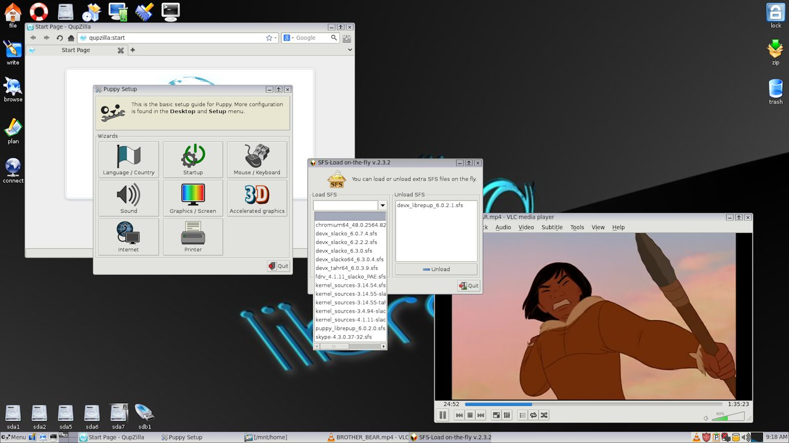

## Screenshots

### Official Puppies

Traditionally, Puppy Linux has used the combination of 
[JWM](http://joewing.net/projects/jwm/) and Rox Filer Desktop. It persists
until this day. Love it or hate it, you can't argue with the lightness on the 
system of this combination. It has certainly stood the test of time!

There has been a couple of exceptions to this rule, notably when Lupu's
developer Larry Short decided to try _IceWM / Rox_ combination but ultimately
settled on _Open Box / FBPanel / Rox_.

#### Chech the action

Check puppylinux 8 in action in this youtube [video](https://www.youtube.com/watch?v=qibxDA_Kxdk)

#### Tahrpup 6.0.5

Featuring DeadBeef Music Player, URxvt Terminal (with perl support), PaleMoon
Browser and VLC Media Player.

{: .cr-image }

#### Slacko 6.3.0

Featuring Gnumeric, Samba Simple Management, YASSM Share Browser, Rox Filer, 
Welcome screen and Menu.

{: .cr-image }

#### Tahrpup64 6.0.5

Featuring PaleMoon browser, VLC Media Player, Rox Filer and Welcome screen.

{: .cr-image }

#### Slacko64 6.3.0

Featuring Pmusic with Pequaliser, Firefox Browser, Gnome Mplayer and URxvt
Terminal.

{: .cr-image }

### Puplets

Puplet builders are free to explore whatever combination of desktop they like.
LXDE and XFCE Desktop Environments have proven popular alternatives over the 
years.

#### Librepup

Featuring Qupzilla browser, Puppy Setup, VLC Media Player, SFS Load
and JWM / Rox desktop.

{: .cr-image }

#### Lxpup

Featuring Abiword Word Processor, Firefox Browser, Gnome Mplayer, PCManFM
File Manager and the LXDE Desktop.

{: .cr-image }

#### X-Slacko 3.1

Featuring Firefox Browser, Gnome Mplayer, Thunar File Manager and the
XFCE Desktop.

{: .cr-image }

