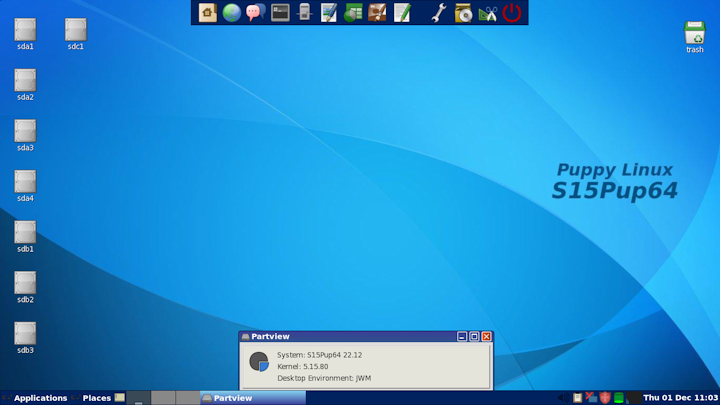
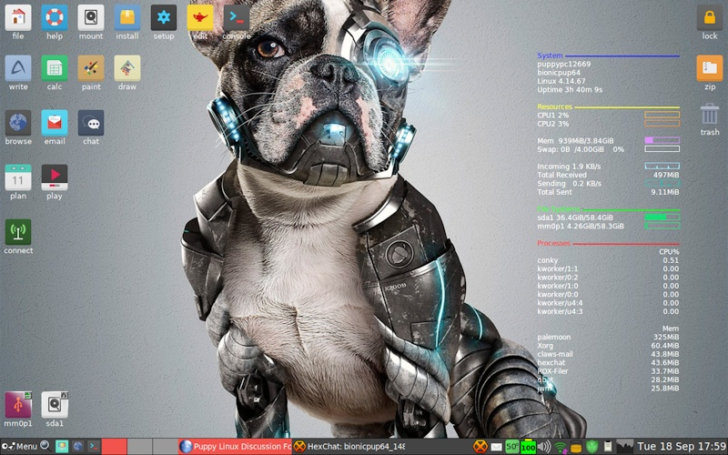

## Screenshots

### Official Puppies

Traditionally, Puppy Linux has used the combination of 
[JWM](http://joewing.net/projects/jwm/) and Rox Filer Desktop. It persists
until this day. Love it or hate it, you can't argue with the lightness on the 
system of this combination. It has certainly stood the test of time!

There has been a couple of exceptions to this rule, with some pups offering LXDE or Xfce desktops.

#### BookwormPups

Featuring JWM, RoxFiler, GTK-3 apps, OverlayFS, USRMerge filesystem, Pulseaudio, ConnMan

{: .cr-image }

{: .cr-image }

#### S15Pup64-22.12

Featuring JWM, RoxFiler, Light browser, Abiword, Gnumeric, PMusic, Gnome Mplayer, PTheme

{: .cr-image }

#### Bionicpup64 8.0

Check **Puppy Linux 8** in action in this youtube [video](https://www.youtube.com/watch?v=qibxDA_Kxdk)



Featuring Home Bank financial tracking, PaleMoon
Browser and an updated version of Rox File file manager.

{: .cr-image }

#### Tahrpup 6.0.5

Featuring DeadBeef Music Player, URxvt Terminal (with perl support), PaleMoon
Browser and VLC Media Player.

{: .cr-image }

#### Slacko 6.3.0

Featuring Gnumeric, Samba Simple Management, YASSM Share Browser, Rox Filer, 
Welcome screen and Menu.

{: .cr-image }

#### Tahrpup64 6.0.5

Featuring PaleMoon browser, VLC Media Player, Rox Filer and Welcome screen.

{: .cr-image }

#### Slacko64 6.3.0

Featuring Pmusic with Pequaliser, Firefox Browser, Gnome Mplayer and URxvt
Terminal.

{: .cr-image }

### Puplets

Puplet builders have the freedom to explore any desktop combination they prefer, with LXDE and XFCE desktop environments having established themselves as popular alternatives over time.

#### Lxpup

Featuring Abiword Word Processor, Light Browser, Gnome Mplayer, PCManFM
File Manager and the LXDE Desktop.

{: .cr-image }

#### X-Slacko 3.1

Featuring Firefox Browser, Gnome Mplayer, Thunar File Manager and the
XFCE Desktop.

{: .cr-image }

